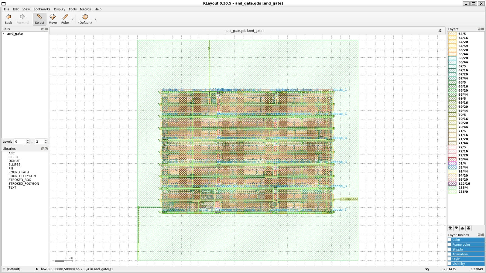
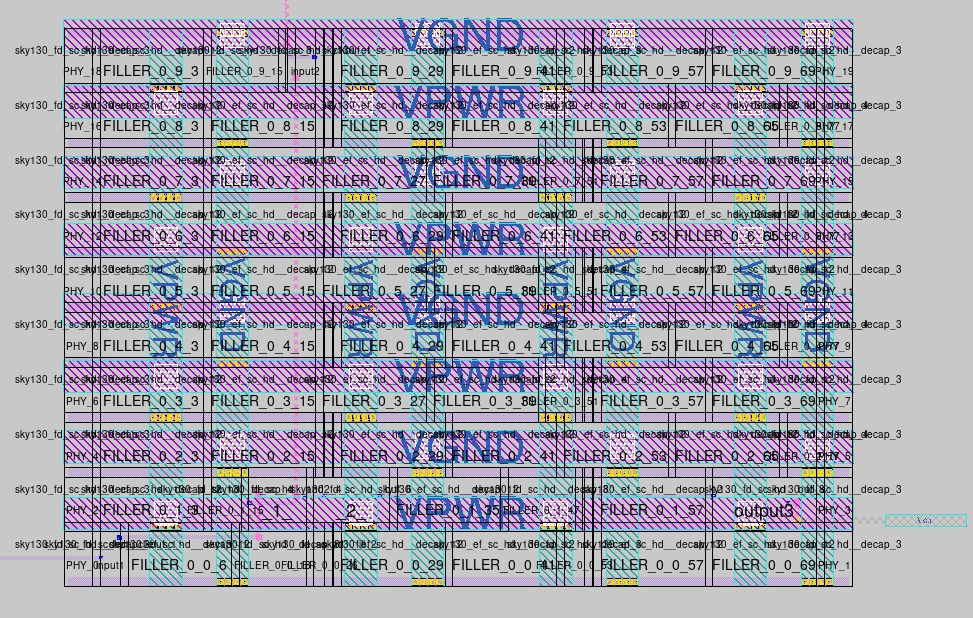
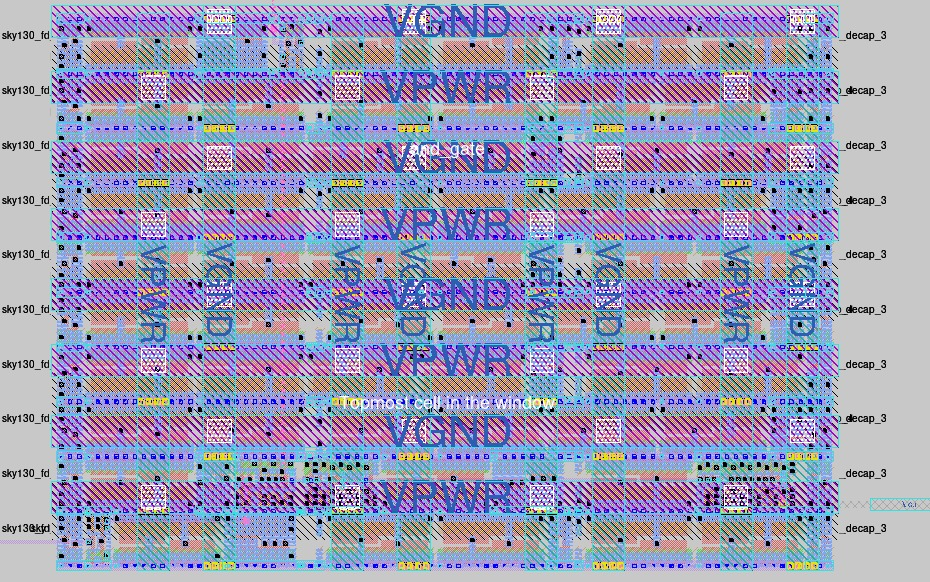
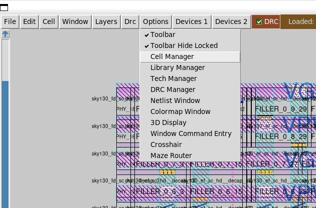
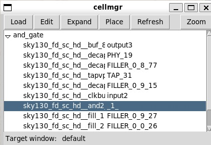
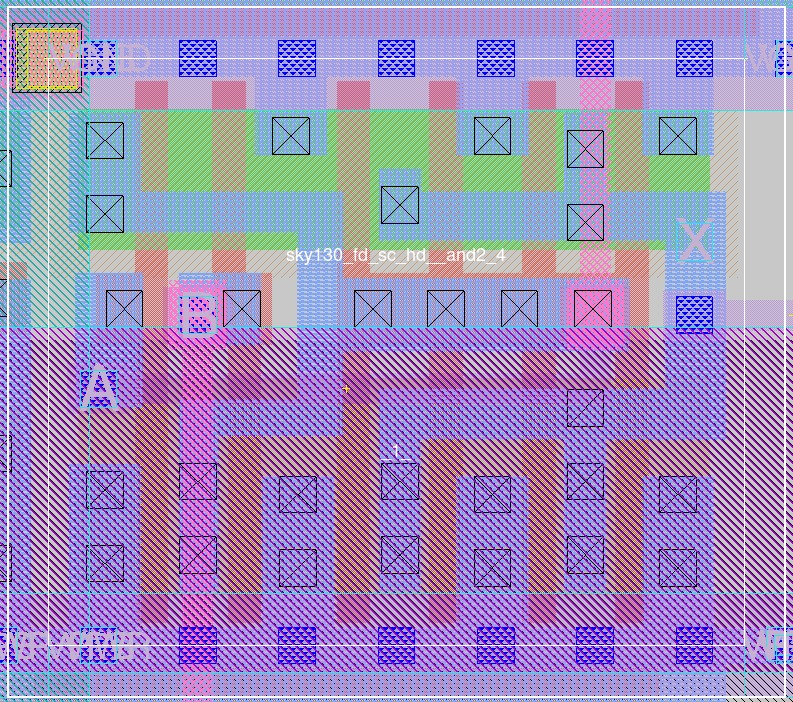

# VLSI-AND-Gate-Design-Flow
This project demonstrates the complete physical implementation of a **two input CMOS AND gate** using the **SkyWater 130nm Process Design Kit**. The study explores two distinct VLSI design methodologies. The first methodology is a **Manual Custom Analog** flow that utilizes Xschem for schematic capture and Magic VLSI for layout. The second methodology is an **Automated Digital ASIC** flow that employs the OpenLane framework to transition from RTL to GDSII.

# 📖 Project Overview
This project explores the implementation of a CMOS AND gate using two primary design methodologies on the **SkyWater 130nm PDK**:

* **Analog/Custom Design Approach** 🎨
</br>This path focuses on transistor-level precision and manual optimization:
  - **Schematic Entry (Xschem):** Designing and implementing an AND gate at the transistor level.
  - **Pre-Layout Simulation:** Verifying the theoretical logic and timing using Ngspice before any physical implementation.
  - **Physical Layout (Magic VLSI):** Manually drawing the silicon layers, following Sky130 design rules.
  - **Parasitic Extraction:** Extracting the RC parasitics (capacitance and resistance) from the physical layout to see real-world effects.
  - **Post-Layout Simulation:** Re-simulating the extracted netlist in Ngspice to ensure the design still meets specs after considering physical interconnects.

* **Digital/Automated Flow** 🤖
</br>This path utilizes the OpenLane automated framework to transform code into hardware:
  - **RTL Design:** Writing the gate logic in behavioral Verilog.
  - **Logic Synthesis:** Mapping the Verilog code to the Sky130 Standard Cell Library.
  - **Floorplanning & Placement:** Automatically defining the die area and placing the standard cells in optimized rows.
  - **Routing:** Automatically generating the metal interconnects to complete the circuit.
  - **GDSII Generation:** Exporting the final mask data ready for fabrication.
  - **ASIC Simulation:** Verifying the digital functionality and gate delays post-implementation.

Both methodologies are reinforced with **Post-Layout Simulations (Ngspice)** to ensure the final designs are logically correct and compliant with foundry-specific physical design rules.

# ✅ Prequisites
The following software programs and libraries are required to execute the full design flow:
| Tool | Function |
|------|----------|
| **Xschem** | Schematic capture & netlist generation |
| **Ngspice** | SPICE simulator |
| **GAW** | Waveform viewer |
| **Magic** | VLSI layout editor |
| **KLayout** | Layout viewer |

Please follow the environment setup guide available at [this link](https://github.com/diices-ub/VLSI-Tools-Instalation-Guide) to install all required dependencies.

# 1. Digital Implementation
## 1.1. Making Behavioral Verilog
Since the project utilizes the OpenLane framework within a Docker container, the Verilog source code must be placed inside the designs directory of the OpenLane environment. This step is crucial so that the automated tools can locate the
RTL description for synthesis and physical implementation. 

Open the directory & make a project directory
```bash
cd OpenLane/designs
mkdir -p and_gate/src
cd and_gate/src
```

Make the Verilog file
```bash
nano and_gate.v
```

Insert this code:
```bash
`timescale 1ns / 1ps

module and_gate(
    input A,
    input B,
    output Vout
    );
    
    assign Vout = A & B;
    
endmodule
```

## 1.2. Making Config File and Floorplan
This section is essential because the config.json file acts as the "instruction manual" for OpenLane. It tells the automated tools exactly how to handle your design during the RTL to GDSII transition.

Make the config file
```bash
cd ..
nano config.json
```

Insert this code:
```bash
{
    "DESIGN_NAME": "and_gate",
    "VERILOG_FILES": "dir::src/and_gate.v",
    "CLOCK_PORT": null,
    "CLOCK_PERIOD": 0,
    "FP_SIZING": "absolute",
    "DIE_AREA": "0 0 50 50",
    "PL_TARGET_DENSITY": 0.5
}
```

### 📘 Configuration Parameter Definitions
The following parameters are used to guide the OpenLane flow for the AND gate implementation:
* **DESIGN_NAME**
</br> This specifies the name of the top level module in your Verilog source code. It must exactly match the module and_gate declaration in your .v file for the tools to recognize the entry point.
* **VERILOG_FILES**
</br> This provides the path to your source code files relative to the project directory. The prefix dir:: is a special syntax that tells OpenLane to look inside the local project folder.
* **CLOCK_PORT & CLOCK_PERIOD**
</br> These define the clock pin name and the target operating frequency. Since the AND gate is a combinational circuit with no sequential elements, the clock port is set to null and the period to 0, as no clock is necessary.
* **FP_SIZING**
</br> This parameter determines how the chip area is calculated. Setting this to absolute allows the designer to manually define the exact dimensions of the floorplan instead of letting the tool calculate it automatically based on cell density.
* **DIE_AREA**
</br> This defines the physical boundaries of the design in micrometers ($\mu m$). The format 0 0 50 50 represents the coordinates of the lower-left and upper-right corners, resulting in a square area of 50 by 50 micrometers.
* **PL_TARGET_DENSITY**
</br> This sets the desired placement density for the standard cells. A value of 0.5 means that the tool will attempt to fill 50 percent of the total area with logic cells, leaving the remaining 50 percent for routing wires and future optimizations.

## 1.3. Running the OpenLane Flow
### Step 1: Initialize the OpenLane Environment
Before running the tools, you must start the Docker container to access the necessary design environment.
```bash
cd ~/OpenLane
make mount
```

### Step 2: Execute the Automated Design Flow
Inside the container, run the main flow script pointing to your project directory. The tool will automatically perform synthesis, floorplanning, placement, and routing.
```bash
./flow.tcl -design and_gate
```
### Step 3: Monitor and Verify the Process
The process consists of approximately 43 steps that transform your logic code into a physical layout. Wait for the terminal to display a message confirming the successful completion of the flow.

* Output Location: Upon finishing, your final GDSII and Spice netlists will be available in the `runs/RUN_<timestamp>/results/final/` directory.
* Verification: Ensure that the DRC and LVS status reports show zero violations to confirm that the design is manufacturable.

Your final GDSII and Spice netlists will be available in the **`runs/RUN_<timestamp>/results/final/`** directory.

On completion, you can exit the Docker container by typing `exit`.

## 1.4. Visualizing the Physical Layout
After the OpenLane flow completes successfully, you can inspect the final physical design using **KLayout** or **Magic VLSI**. These tools allow you to verify the cell placement and metal routing at the silicon level.

### Option 1: Using KLayout
To view the layout, first navigate to gds file directory.
```bash
cd ~/OpenLane/designs/and_gate/runs/RUN_<timestamp>/results/final/gds
```
Open the gds file using KLayout
```bash
klayout and_gate.gds
```
> 📷 *The display below shows a successful KLayout*  
> 

### Option 2: Using Magic VLSI
To view the layout, first navigate to mag file directory.
```bash
cd ~/OpenLane/designs/and_gate/runs/RUN_<timestamp>/results/final/mag
```
Open the gds file using KLayout
```bash
magic and_gate.mag
```
> 📷 *The display below shows a successful Magic VLSI*  
> 

When you first open the mag file, standard cells often appear as empty boxes or solid blocks. You can use these shortcuts to look inside:
```bash
Press "x" This will Expand the cell you have selected. It reveals the internal transistors, diffusion layers, and poly-silicon that were previously hidden inside the "box".
```
> 📷 *Expanded Visual of Magic VLSI*  
> 

To locate the "AND" logic gate cell, navigate to 'Options' and `Cell Manager`.
> 

Select `sky130_fd_sc_hd__and2._1_` and select `zoom`. 
> 

</br> This process will immediately locate the specific gate and automatically adjust the camera to focus on the designated silicon area, allowing you to see the transistor structures without being distracted by the surrounding fillers.

> 📷 *Isolated "AND" Gate Layout*  
> 

## 1.5. Extracting .spice Model From Layout
Post layout simulation provides a more accurate representation of the circuit performance compared to the initial schematic. This process accounts for the parasitic capacitance and resistance that are inherent in the physical silicon layers and metal interconnects.

</br> To begin, we must extract the physical data from the Magic layout into a format that a simulator can understand. Inside the Magic console, we use the following commands:
```bash
extract all
ext2spice
ext2spice
```

Make Test Bench File:
```bash
nano tb_and_gate.spice
```

Add the following script:
```bash
* Final Transistor Level Testbench

* 1. Include the foundational transistor models
.lib "/home/sunmoon/.ciel/sky130A/libs.tech/ngspice/sky130.lib.spice" tt

* 2. Include the generated spice netlist
.include "and_gate.spice"

* 3. Power Supply configuration
Vdd VPWR 0 1.8
Vss VGND 0 0

* 4. Input Signal definitions
Va A VGND pulse(0 1.8 1n 1n 1n 20n 40n)
Vb B VGND pulse(0 1.8 1n 1n 1n 40n 80n)

* 5. Component Instantiation (Pin Order: A B VGND VPWR Vout)
X1 A B VGND VPWR Vout and_gate

.control
  save all
  tran 1n 160n
  run
  
  * Plotting the input and output waveforms
  plot v(A) v(B) v(Vout)
.endc
.end
```

Finally run the test bench:
```bash
ngspice tb_and_gate.spice
```


